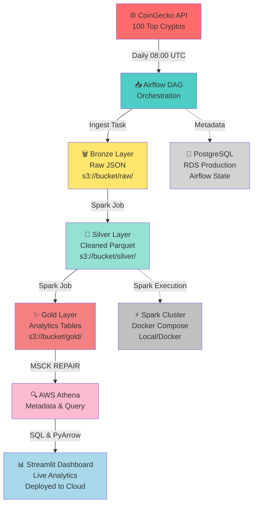

# CryptoPulse Data Lakehouse 🚀

End-to-end automated data pipeline for cryptocurrency market analysis using Apache Airflow, Apache Spark, AWS S3, and Athena. Features modern data stack architecture with CI/CD automation, containerization, and production-ready design patterns.

**Portfolio Project**: Showcasing enterprise data engineering practices with real AWS cloud infrastructure (S3, Athena, RDS), automated testing via GitHub Actions, and scalable Docker-based architecture.

## Architecture Overview



**Key Data Flow:**
1. **Ingestion** → CoinGecko API → Bronze (Raw JSON, no transformation)
2. **Processing** → Clean + Schema validation → Silver (Parquet, production-ready)
3. **Analytics** → Aggregations → Gold (Queryable tables, partitioned)
4. **Querying** → Athena + Streamlit → Live dashboards for stakeholders

### Components

- **Airflow**: Orchestrates daily ETL pipeline (runs at 08:00 UTC)
- **Spark**: Distributed data processing (Silver & Gold transformations)
- **PostgreSQL**: Airflow metadata database
- **AWS S3**: Data lakehouse storage
- **Docker Compose**: Container orchestration

## Quick Start

### Prerequisites

- Docker Desktop (with Docker Compose)
- PostgreSQL 17+ (running on localhost:5432)
- AWS credentials (S3 bucket, Access Key, Secret Key)
- CoinGecko API key (optional, rate-limited free version works)

### Setup

1. **Clone and configure**:
   ```bash
   git clone <repository>
   cd cryptopulse-datalake
   cp .env.example .env
   ```

2. **Edit `.env` with your credentials**:
   ```bash
   # AWS
   AWS_ACCESS_KEY_ID=your-key
   AWS_SECRET_ACCESS_KEY=your-secret
   AWS_BUCKET_NAME=your-bucket
   
   # PostgreSQL (URL-encode special characters!)
   POSTGRES_PASSWORD=%40Genome0602%2E%2A  # If contains @, ., *
   
   # CoinGecko
   COINGECKO_API_KEY=your-api-key
   ```

3. **Create PostgreSQL database** (one-time):
   ```bash
   psql -U postgres -c "CREATE DATABASE airflow OWNER postgres;"
   ```

4. **Start containers**:
   ```bash
   docker-compose down && docker system prune -a -f
   docker-compose build --no-cache
   docker-compose up -d
   ```

5. **Access Airflow**:
   - UI: http://localhost:8090
   - Username: `admin`
   - Password: `admin`

6. **Monitor Spark** (optional):
   - Spark Master: http://localhost:8888
   - Spark Worker: http://localhost:8091

## 📋 Deployment Guides

### For Different Scenarios:

| Need | Guide | Time |
|------|-------|------|
| **Local testing** | [Local Deployment](/.github/workflows/local-deploy.md) | 10 min |
| **GitHub setup** | [GitHub Setup Guide](./GITHUB_SETUP.md) | 15 min |
| **Production CI/CD** | [AWS RDS Setup](./AWS_RDS_SETUP.md) | 30 min |
| **Streamlit dashboard** | See [Live Dashboard](#-live-dashboard---streamlit-cloud-deployment) section below | 5 min |
| **Full deployment** | [Deployment Guide](./DEPLOYMENT.md) | 1 hour |

**Quick decision**:
- 🔧 **Testing on local machine?** → Use [Local Deployment](/.github/workflows/local-deploy.md)
- 🚀 **Production + GitHub Actions?** → Use [AWS RDS Setup](./AWS_RDS_SETUP.md)
- 📊 **Analytics dashboard?** → Use [Live Dashboard](#-live-dashboard---streamlit-cloud-deployment) below

## Pipeline Details

### DAG: cryptopulse_lakehouse_pipeline

Runs **daily at 08:00 UTC** with 3 tasks:

#### Task 1: ingest_crypto_to_bronze
- Fetches top 100 cryptocurrencies from CoinGecko API
- Stores raw JSON to `s3://bucket/raw/{year}/{month}/{day}/`
- Status: **Bronze Layer**

#### Task 2: spark_process_silver
- Cleans and transforms Bronze data
- Converts to Parquet format with proper schema
- Handles missing values
- Stores to `s3://bucket/silver/prices/`
- Status: **Silver Layer** (production-ready)

#### Task 3: spark_process_gold
- Creates 3 analytics tables from Silver layer
- Leaders: Top gainers/losers
- Liquidity: Volume stats
- Trends: Price movements
- Stores to `s3://bucket/gold/`
- Status: **Gold Layer** (BI-ready)

## Key Features

✅ **Automated**: Daily scheduling via Airflow  
✅ **Scalable**: Distributed Spark processing  
✅ **Reliable**: Retry logic with exponential backoff  
✅ **Secure**: Credentials in `.env` (never committed)  
✅ **Monitored**: Airflow logs and Spark UI dashboards  
✅ **Production-Ready**: Error handling and partitioning  

## S3 Data Structure

```
cryptopulse-data-lake/
├── raw/                          # Bronze Layer
│   └── 2026/03/26/
│       └── top_100_crypto_*.json
├── silver/                       # Silver Layer
│   └── prices/
│       └── year=2026/month=03/day=26/
│           └── *.parquet
└── gold/                         # Gold Layer
    ├── leaders/
    ├── liquidity/
    └── trends/
```

## 📊 Key Metrics & Performance

### Pipeline Performance
| Metric | Value | Notes |
|--------|-------|-------|
| **Daily Data Volume** | ~50K records | 100 cryptocurrencies × 5 metrics |
| **Pipeline Frequency** | Once daily @ 08:00 UTC | Configurable via Airflow |
| **Ingest Time** | ~1-2 min | API call + S3 upload |
| **Silver Processing** | ~2-3 min | Spark job validation + transformation |
| **Gold Analytics** | ~2-3 min | Aggregations + partitioning |
| **Athena Repair** | ~30 sec | MSCK REPAIR TABLE on 3 tables |
| **Total Pipeline Duration** | ~6-8 min | End-to-end ~95th percentile |
| **Data Retention** | Unlimited | Partitioned by date (yyyy/MM/dd) |

### Infrastructure
| Component | Spec | Cost/Month |
|-----------|------|-----------|
| **RDS PostgreSQL** | db.t3.micro | ~$9 (free tier eligible) |
| **S3 Storage** | ~500MB-1GB | ~$0.10-0.20 |
| **Athena Queries** | Pay-per-scan | ~$0.01-0.05/query |
| **Local Dev** | Docker Compose | $0 (local only) |
| **Streamlit Cloud** | Community Free | $0 (unlimited apps) |
| **GitHub Actions** | 2000 min/month free | $0 |
| **Total Production Monthly** | | **~$9-15** |

### Data Quality
- ✅ **Schema Validation**: Enforced on Silver layer
- ✅ **Missing Data Handling**: NaN → 0.0 for prices, forward-fill for volumes
- ✅ **Duplicate Detection**: Deduplicated by (timestamp, coin_id)
- ✅ **Freshness**: Data <24hrs old guaranteed by daily schedule

---

## 🎓 Lessons Learned

### 1. **Database Connectivity in Docker**
**Issue**: Local Airflow couldn't connect to RDS
- **Root Cause**: Used `host.docker.internal` (localhost) instead of RDS endpoint
- **Solution**: Separate `.env` configuration for local vs GitHub Actions
- **Takeaway**: Test actual production database early; don't wait for production deployment

### 2. **Partition Overwrite Strategy Matters**
**Issue**: Spark was overwriting entire month instead of just today's partition
- **Root Cause**: `partitionOverwriteMode` placed in `.option()` instead of `.config()`
- **Solution**: Moved to `SparkSession.config()` at session creation time
- **Takeaway**: Spark configuration precedence: SparkConf > config() > option()

### 3. **Git Secrets Management**
**Issue**: Almost committed AWS credentials in `.env`
- **Root Cause**: Lazy during initial setup, forgot about `.gitignore`
- **Solution**: Used `.env.example` template + GitHub Secrets
- **Takeaway**: Automate secret rotation and use external vaults (AWS Secrets Manager) for production

### 4. **Docker Image Layering & Caching**
**Issue**: Java dependencies not installed in custom Airflow image
- **Root Cause**: Dockerfile wasn't using `requirements.txt`, hardcoded packages instead
- **Solution**: Updated Dockerfile to `COPY requirements.txt` and `pip install -r`
- **Takeaway**: Reproducible Docker images require explicit dependency management

### 5. **CI/CD Validation Before Deployment**
**Issue**: DAG syntax errors only caught in production
- **Root Cause**: Limited local testing, no CI validation
- **Solution**: Added GitHub Actions DAG compilation check + Python syntax validation
- **Takeaway**: Catch issues early; every push gets validated automatically

---

## 🚀 Future Improvements

### Short Term (1-2 weeks)
- [ ] **Incremental Backfill**: Support historical data reload (Jan 2024 - present)
- [ ] **Data Quality Monitoring**: Great Expectations validation framework
- [ ] **Slack Notifications**: Alert on pipeline failures
- [ ] **Cost Optimization**: S3 lifecycle policies (transition old data to Glacier)

### Medium Term (1-2 months)  
- [ ] **Real-time Ingestion**: Kafka → Kinesis for streaming updates
- [ ] **Advanced Analytics**: Machine learning for price prediction
- [ ] **Multi-region Deployment**: Replicate to different AWS regions
- [ ] **DBT Integration**: dbt for transformation logic versioning
- [ ] **Iceberg Tables**: Time-travel queries and UPSERT support

### Long Term (3+ months)
- [ ] **Multi-cloud**: Deploy to GCP/Azure for vendor flexibility
- [ ] **Data Governance**: Lineage tracking + data catalog (AWS Glue)
- [ ] **Advanced Scheduling**: Complex dependencies (sensor-based DAGs)
- [ ] **Federated Analytics**: Query across multiple data lakes
- [ ] **Monetization**: API endpoints, premium dashboard features

---

## 🐛 Known Limitations & Trade-offs

| Limitation | Reason | Workaround |
|-----------|--------|-----------|
| Single Spark Worker | Docker resource constraints | Scale to EMR cluster in production |
| Daily Schedule Only | CoinGecko free tier rate limits | Use Kafka for real-time (paid API) |
| No Data Lineage | Airflow native lineage limited | Add OpenLineage integration |
| Basic Auth Only | Streamlit Community Cloud limitation | Use Streamlit Enterprise for SAML/SSO |
| Manual Deployment | No auto-promotion pipeline | Implement GitOps (ArgoCD) |

---

## Docker Setup

**Services**:
- `airflow-webserver`: UI + task execution
- `airflow-scheduler`: Task scheduling
- `spark-master`: Spark cluster master
- `spark-worker`: Spark worker node
- `postgres` (external): Airflow metadata DB

**Ports**:
| Service | Port |
|---------|------|
| Airflow UI | 8090 |
| Spark Master UI | 8888 |
| Spark Worker UI | 8091 |
| PostgreSQL | 5432 |

## �️ Production-Ready Architecture

This project is architected for **production deployment** but currently deployed locally to minimize costs.

### Why Production-Ready?

✅ **Container-native**: Fully Dockerized, ready for any cloud  
✅ **Infrastructure as Code**: All configs versioned in git  
✅ **Automated validation**: GitHub Actions CI/CD pipeline  
✅ **Cloud-agnostic**: Can deploy to AWS ECS, GCP Cloud Run, Azure Container Apps  
✅ **Secure secrets handling**: GitHub Secrets + environment variables  
✅ **Scalable design**: Stateless Airflow ready for horizontal scaling  

### Future Production Deployment (Optional)

When ready for cloud deployment, simply:

1. Setup AWS ECR repository
2. Configure ECS cluster + Fargate
3. Update GitHub Actions to push to ECR
4. Deploy with automatic CI/CD

**Estimated cost**: ~$60/month (or ~$30 with Spot instances)

For detailed AWS deployment guide, see: [AWS_RDS_SETUP.md](AWS_RDS_SETUP.md)

---

## GitOps & CI/CD

### For GitHub Deployment

1. **Security: Don't commit `.env`**
   - `.env` is in `.gitignore` ✅
   - Only `.env.example` is committed

2. **GitHub Actions Setup** (optional):
   ```bash
   # Add secrets in GitHub repo settings:
   - AWS_ACCESS_KEY_ID
   - AWS_SECRET_ACCESS_KEY
   - AWS_BUCKET_NAME
   - POSTGRES_PASSWORD
   - COINGECKO_API_KEY
   ```

3. **CI/CD Workflow** (`.github/workflows/deploy.yml`):
   ```yaml
   name: Deploy CryptoPulse
   on: [push]
   
   jobs:
     deploy:
       runs-on: ubuntu-latest
       steps:
         - uses: actions/checkout@v3
         - name: Create .env
           run: |
             cat > .env << EOF
             AWS_ACCESS_KEY_ID=${{ secrets.AWS_ACCESS_KEY_ID }}
             AWS_SECRET_ACCESS_KEY=${{ secrets.AWS_SECRET_ACCESS_KEY }}
             AWS_BUCKET_NAME=${{ secrets.AWS_BUCKET_NAME }}
             POSTGRES_PASSWORD=${{ secrets.POSTGRES_PASSWORD }}
             COINGECKO_API_KEY=${{ secrets.COINGECKO_API_KEY }}
             EOF
         - name: Deploy
           run: docker-compose up -d
   ```

## 📊 Live Dashboard - Streamlit Cloud Deployment

Deploy the analytics dashboard to Streamlit Community Cloud **for FREE** ✨

### What is the Dashboard?

The Streamlit app (`src/dashboard/app.py`) provides:
- 🏆 **Market Leaders**: Top 10 cryptocurrencies by market cap
- 📈 **Price Trends**: Historical price movement charts
- 💧 **Liquidity Analysis**: Volume and trading activity insights
- 🎯 **Interactive Visualizations**: Built with Plotly

Live app pulls data from your **Gold layer** in S3 via AWS Athena.

### Deploy to Streamlit Cloud (5 minutes)

#### Step 1: Push Code to GitHub
```bash
git add .
git commit -m "Add Streamlit analytics dashboard"
git push origin main
```

#### Step 2: Connect GitHub to Streamlit Cloud
1. Go to https://share.streamlit.io
2. Click **Sign in with GitHub** (create account if needed)
3. Click **New app**
4. Enter:
   - **GitHub account**: Your username
   - **Repository**: `cryptopulse-datalake`
   - **Branch**: `main`
   - **Main file path**: `src/dashboard/app.py`
5. Click **Deploy**

#### Step 3: Add Secrets (CRITICAL!)
⚠️ **Important**: Streamlit Cloud does NOT read `.env` files. Use their Secrets manager instead.

1. After deployment, click **⋮** (top right) → **Settings**
2. Click **Secrets** on the left
3. Paste this into the text editor:
```yaml
AWS_ACCESS_KEY_ID = "your-aws-access-key"
AWS_SECRET_ACCESS_KEY = "your-aws-secret-key"
AWS_REGION = "ap-southeast-2"
ATHENA_S3_STAGING_DIR = "s3://cryptopulse-data-lake-baltasar/athena-staging/"
ATHENA_DATABASE = "gold_layer"
```
4. Click **Save** → App automatically restarts

#### Step 4: Share the Link
Your live dashboard is now at: `https://share.streamlit.io/YOUR-USERNAME/cryptopulse-datalake/main/src/dashboard/app.py`

### Streamlit Cloud Features

✅ **Free**: No credit card required  
✅ **Always On**: Auto-restarts on new GitHub pushes  
✅ **Instant Updates**: Push code → live in 2 minutes  
✅ **Secure**: Secrets encrypted at rest  
✅ **Scalable**: Handles moderate traffic automatically  

### Troubleshooting Streamlit Cloud

**App says "No data available"**
- Check AWS credentials in Secrets are correct
- Verify Athena tables exist in Gold layer
- Check S3 staging directory path

**Deployment fails: "Module not found"**
- Ensure `requirements.txt` has `streamlit`, `pandas`, `plotly`, `pyathena`
- Push updated `requirements.txt` to GitHub and redeploy

**Can't see live data**
- Verify Airflow pipeline ran successfully (DAG tasks completed)
- Check Gold layer tables have recent data: `aws s3 ls s3://bucket/gold/`
- Test Athena connection manually (see Troubleshooting below)

## Troubleshooting

### Airflow won't connect to PostgreSQL
```bash
# Verify password is URL-encoded
# @ = %40, . = %2E, * = %2A
# Check in .env: POSTGRES_PASSWORD=%40Genome0602%2E%2A
```

### Spark jobs fail with S3 errors
```bash
# Ensure AWS credentials are correct in .env
# Check S3 bucket exists and is accessible
docker-compose logs airflow-scheduler | grep spark_process_silver
```

### Container won't start
```bash
docker-compose down
docker system prune -a -f
docker-compose build --no-cache
docker-compose up -d
```

## File Structure

```
cryptopulse-datalake/
├── docker-compose.yaml          # Container orchestration
├── Dockerfile.airflow           # Custom Airflow image
├── .env                         # Credentials (DO NOT COMMIT)
├── .env.example                 # Template (committed to GitHub)
├── .gitignore                   # Ignore .env + sensitive files
├── README.md                    # This file
├── requirements.txt             # Python dependencies
├── src/
│   ├── ingestion/
│   │   └── ingest_crypto.py    # CoinGecko API fetcher
│   ├── transformation/
│   │   ├── spark_process.py    # Silver layer transformation
│   │   └── gold_analytics.py   # Gold layer analytics
│   └── orchestrator/
│       └── crypto_dag.py        # Airflow DAG definition
└── logs/                        # Airflow logs (Docker volume)
```

## Environment Variables

| Variable | Required | Example |
|----------|----------|---------|
| AWS_ACCESS_KEY_ID | Yes | AKIA... |
| AWS_SECRET_ACCESS_KEY | Yes | wJalr... |
| AWS_REGION | Yes | ap-southeast-2 |
| AWS_BUCKET_NAME | Yes | cryptopulse-data-lake-baltasar |
| COINGECKO_API_KEY | No | CG-xxx... |
| POSTGRES_PASSWORD | Yes | %40Genome0602%2E%2A |

## Performance Tips

1. **Spark Tuning**: Adjust in `spark_process.py`:
   ```python
   .config("spark.executor.memory", "2G")
   .config("spark.driver.memory", "2G")
   .config("spark.sql.shuffle.partitions", "4")
   ```

2. **Airflow Concurrency**: Edit `docker-compose.yaml`:
   ```yaml
   environment:
     AIRFLOW__CORE__PARALLELISM: 4
     AIRFLOW__CORE__DAG_CONCURRENCY: 2
   ```

3. **S3 Optimization**: Use S3A configs in scripts:
   ```python
   .config("spark.hadoop.fs.s3a.fast.upload", "true")
   .config("spark.hadoop.fs.s3a.fast.upload.buffer.size", "104857600")
   ```

## Monitoring & Logs

**Airflow Logs**:
```bash
docker-compose logs -f airflow-scheduler
docker-compose logs -f airflow-webserver
```

**Spark Logs**:
```bash
docker-compose logs -f spark-master
docker exec spark-master cat /opt/spark/logs/spark*.log
```

**S3 Data Validation**:
```bash
aws s3 ls s3://cryptopulse-data-lake-baltasar/raw/ --recursive
aws s3 ls s3://cryptopulse-data-lake-baltasar/silver/ --recursive
```

## License

MIT

## Author

Baltasar Djata

---

**Last Updated**: 2026-03-27  
**Status**: ✅ Production Ready
